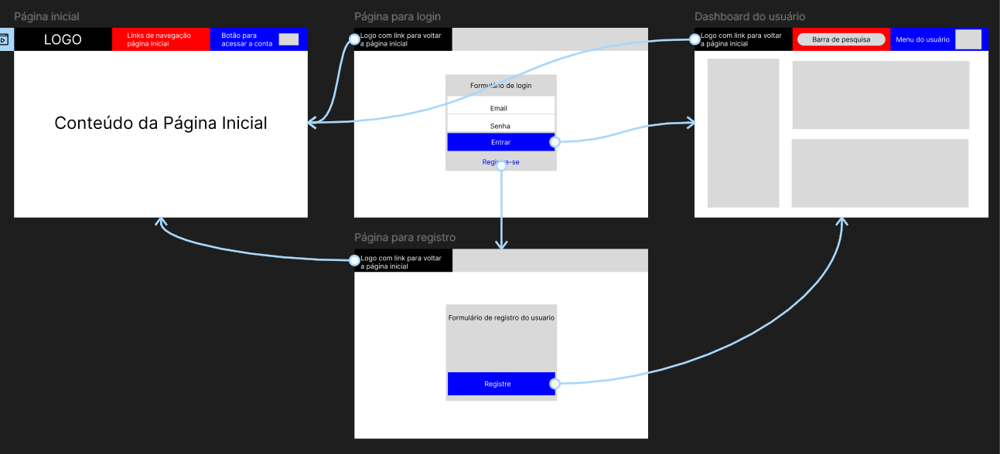
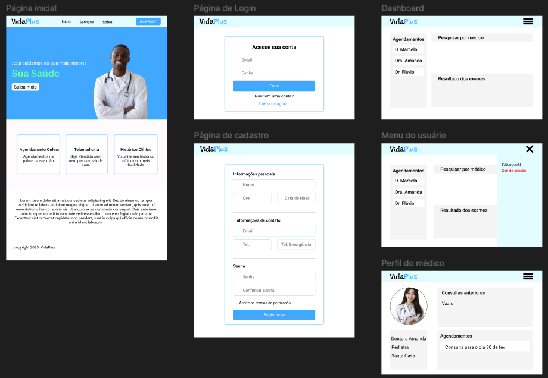
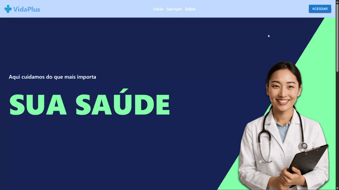

# Projeto Multidisciplinar - Ênfase em Frontend

---

## 🔗 Links para navegação
- [⚠️ Objetivo](#objetivo)
- [📕 Caso de estudo](#caso-de-estudo)
- [📋 Requisitos](#requisitos)
- [🎨 Protótipos](#prototipos)
- [🤖 Tecnologias](#tecnologias)
- [🏁 O que faz](#oque-faz)
- [🏋️ Exemplo de execução](#exemplo)
- [👨‍💻 Autor](#autor)
- [📄 Licença](#licenca)

---

## ⚠️ Objetivo
 Neste projeto, terei a oportunidade de integrar os conhecimentos adquiridos ao longo do curso e aplicá-los em um **Estudo de caso na área da saúde**. O objetivo é desenvolver um sistema teórico (com protótipo, documentação ou código funcional) que atenda aos requisitos propostos.

---

## 📕 Caso de estudo
A instituição VidaPlus administra hospitais, clínicas de bairro, laboratórios e equipes de home care. Ela precisa de um Sistema de Gestão Hospitalar e de Serviços de Saúde (SGHSS) para centralizar: 
1. **Cadastro e Atendimento de Pacientes:** consultas, exames, prontuários, telemedicina. 
2. **Gestão de Profissionais de Saúde:** médicos, enfermeiros, técnicos, agendas, prescrições. 
3. **Administração Hospitalar:** leitos, relatórios financeiros, suprimentos. 
4. **Telemedicina:** atendimentos e prescrições online, marcação de consultas presenciais e exames. 
5. **Segurança e Compliance:** controle de acesso, LGPD, registros de auditoria.

---

## 📋 Requisitos
1. ### ✅ Funcionais (RF):

    Requisitos funcionais descrevem o que o sistema deve fazer.
    
    #### RF01 – Pacientes
        - Cadastrar dados pessoais e clínicos.

        - Visualizar histórico clínico.

        - Agendar e cancelar consultas.

        - Receber notificações (ex: lembretes de consulta).

        - Acessar sessões de teleconsulta.

    #### RF02 – Profissionais de Saúde
        - Gerenciar suas próprias agendas.

        - Atualizar prontuários médicos dos pacientes.

        - Emitir receitas digitais.

        - Acompanhar o histórico clínico dos pacientes atendidos.

    #### RF03 – Administradores
        - Gerenciar cadastros de pacientes e profissionais de saúde.

        - Controlar o fluxo de internações hospitalares.

        - Gerar relatórios administrativos e estatísticos.

    #### RF04 – Telemedicina
        - Realizar videochamadas seguras com os pacientes.

        - Registrar prontuários eletrônicos durante ou após a consulta.

        - Emitir prescrições online durante a teleconsulta.

2. ### ⚙️ Não Funcionais (RNF):
    
    Requisitos não funcionais dizem como o sistema deve se comportar.

    #### RNF01 – Segurança
        - Utilizar criptografia para dados sensíveis (ex: dados de pacientes).

        - Implementar controle de acesso baseado em perfis (paciente, profissional, admin).

        - Registrar logs de uso e ações para auditoria.

        - Estar em conformidade com a LGPD (Lei Geral de Proteção de Dados).

    #### RNF02 – Escalabilidade
        - O sistema deve ser capaz de suportar múltiplas unidades hospitalares em operação simultânea.

    #### RNF03 – Desempenho
        - Garantir tempo de resposta rápido, especialmente em consultas críticas ou operações urgentes.

    #### RNF04 – Acessibilidade
        - Interface amigável e responsiva.

        - Seguir padrões internacionais de acessibilidade (W3C/WCAG).

    #### RNF05 – Disponibilidade
        - Ter disponibilidade mínima de 99,5%.

        - Contar com rotinas de backup e geração de logs robustos para garantir a recuperação de dados e rastreamento.

---

## 🎨 Protótipos

Protótipos são versões preliminares da interface de um sistema.

1. ### Baixa fidelidade

    Valida ideias e fluxos rapidamente.

    

2. ### Média/alta fidelidade

    Aproxima-se mais do produto final (ainda não reflete como o produto final se parecerá).

    
    [Link para o protótipo no Figma](https://www.figma.com/design/XiryicMrJK9n9ubcwu09lS/Untitled?node-id=50-2&t=OYdr396MsLzCelwq-1)

    

---

## 🤖 Tecnologias

1. ### Frontend
    - React
    - Material ui
    - React-router-dom
    - Cleave.js
    - Tailwindcss
    - Axios

2. ### Backend
    - express
    - bcrypt
    - dotenv
    - pg
    - express-session
    - passport
    - passport-local
    - multer
    - path
    - fs

3. ### Banco de dados
    - Postgresql
    

---

## 🏁 O que faz
Observação: atualmente só funciona localmente.
- [x] Login de usuários cadastrados
- [x] Registro de novos usuários (pacientes)
- [x] Informa erros, como email ou senha incorretas
- [x] Permite sessões
- [X] Registro de instituições de saúde
- [X] Registro de médicos
- [ ] Agendamentos

---

## 🏋️ Exemplo de execução

---

## 👨‍💻 Autor

Desenvolvido por **Felipe Cesar Rodrigues**  
Projeto acadêmico multidisciplinar com ênfase em Frontend – 2025  
Contato: [LinkedIn](https://www.linkedin.com/in/felipe-cesar-rodrigues/) | [GitHub](https://github.com/Kiy0p0N)

--- 

## 📄 Licença

Licenciado sob a [MIT License](./LICENSE).

